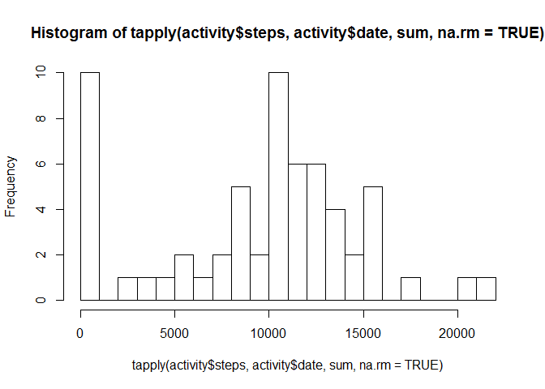
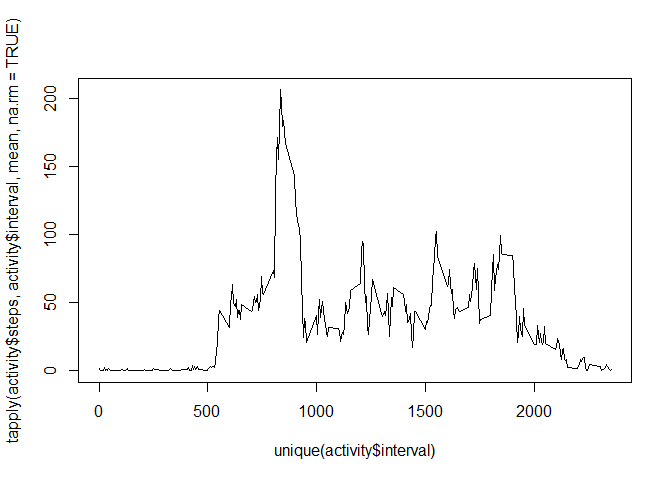
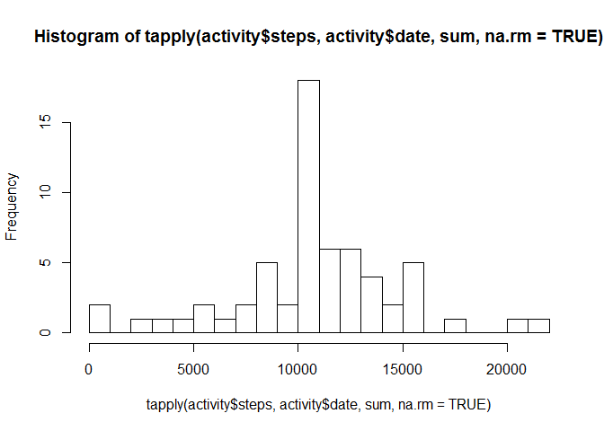
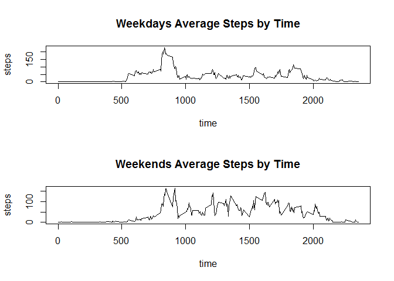

Let's load in the data

    activity <- read.csv(file="activity.csv",head=TRUE,sep=",")
    head(activity)

    ##   steps       date interval
    ## 1    NA 2012-10-01        0
    ## 2    NA 2012-10-01        5
    ## 3    NA 2012-10-01       10
    ## 4    NA 2012-10-01       15
    ## 5    NA 2012-10-01       20
    ## 6    NA 2012-10-01       25

Let's figure out what the mean number of steps by day is. We'll use
tapply for this.

    tapply(activity$steps, activity$date, sum, na.rm=TRUE)

    ## 2012-10-01 2012-10-02 2012-10-03 2012-10-04 2012-10-05 2012-10-06 
    ##          0        126      11352      12116      13294      15420 
    ## 2012-10-07 2012-10-08 2012-10-09 2012-10-10 2012-10-11 2012-10-12 
    ##      11015          0      12811       9900      10304      17382 
    ## 2012-10-13 2012-10-14 2012-10-15 2012-10-16 2012-10-17 2012-10-18 
    ##      12426      15098      10139      15084      13452      10056 
    ## 2012-10-19 2012-10-20 2012-10-21 2012-10-22 2012-10-23 2012-10-24 
    ##      11829      10395       8821      13460       8918       8355 
    ## 2012-10-25 2012-10-26 2012-10-27 2012-10-28 2012-10-29 2012-10-30 
    ##       2492       6778      10119      11458       5018       9819 
    ## 2012-10-31 2012-11-01 2012-11-02 2012-11-03 2012-11-04 2012-11-05 
    ##      15414          0      10600      10571          0      10439 
    ## 2012-11-06 2012-11-07 2012-11-08 2012-11-09 2012-11-10 2012-11-11 
    ##       8334      12883       3219          0          0      12608 
    ## 2012-11-12 2012-11-13 2012-11-14 2012-11-15 2012-11-16 2012-11-17 
    ##      10765       7336          0         41       5441      14339 
    ## 2012-11-18 2012-11-19 2012-11-20 2012-11-21 2012-11-22 2012-11-23 
    ##      15110       8841       4472      12787      20427      21194 
    ## 2012-11-24 2012-11-25 2012-11-26 2012-11-27 2012-11-28 2012-11-29 
    ##      14478      11834      11162      13646      10183       7047 
    ## 2012-11-30 
    ##          0

Let's make a histogram of these steps

    histinfo <- hist(tapply(activity$steps, activity$date, sum, na.rm=TRUE), breaks=20)

    histinfo

    ## $breaks
    ##  [1]     0  1000  2000  3000  4000  5000  6000  7000  8000  9000 10000
    ## [12] 11000 12000 13000 14000 15000 16000 17000 18000 19000 20000 21000
    ## [23] 22000
    ## 
    ## $counts
    ##  [1] 10  0  1  1  1  2  1  2  5  2 10  6  6  4  2  5  0  1  0  0  1  1
    ## 
    ## $density
    ##  [1] 1.639344e-04 0.000000e+00 1.639344e-05 1.639344e-05 1.639344e-05
    ##  [6] 3.278689e-05 1.639344e-05 3.278689e-05 8.196721e-05 3.278689e-05
    ## [11] 1.639344e-04 9.836066e-05 9.836066e-05 6.557377e-05 3.278689e-05
    ## [16] 8.196721e-05 0.000000e+00 1.639344e-05 0.000000e+00 0.000000e+00
    ## [21] 1.639344e-05 1.639344e-05
    ## 
    ## $mids
    ##  [1]   500  1500  2500  3500  4500  5500  6500  7500  8500  9500 10500
    ## [12] 11500 12500 13500 14500 15500 16500 17500 18500 19500 20500 21500
    ## 
    ## $xname
    ## [1] "tapply(activity$steps, activity$date, sum, na.rm = TRUE)"
    ## 
    ## $equidist
    ## [1] TRUE
    ## 
    ## attr(,"class")
    ## [1] "histogram"

Calculate the mean and median of the total steps per day

    mean(tapply(activity$steps, activity$date, sum, na.rm=TRUE))

    ## [1] 9354.23

    median(tapply(activity$steps, activity$date, sum, na.rm=TRUE))

    ## [1] 10395

Let's calcualte a time series Its the time interval of the day on the
x-axis (think of this like military time) and on the y-axis you have the
number of steps

    the_timeseries <- ts(tapply(activity$steps, activity$interval, mean, na.rm=TRUE))
    plot(unique(activity$interval), tapply(activity$steps, activity$interval, mean, na.rm=TRUE),  type="l")

Which 5-minute interval, on average across all the days in the dataset,
contains the maximum number of steps?

    table_of_averages <- aggregate(activity$steps, list(activity$interval), mean, na.rm=TRUE)
    subset(table_of_averages, table_of_averages$x == max(table_of_averages$x))

    ##     Group.1        x
    ## 104     835 206.1698

Looks like the 835 time is the best

Imputing missing values

Note that there are a number of days/intervals where there are missing
values (coded as NA). The presence of missing days may introduce bias
into some calculations or summaries of the data.

Calculate and report the total number of missing values in the dataset
(i.e. the total number of rows with NAs)

    new_activity_DF<-activity[rowSums(is.na(activity)) > 0,]
    nrow(new_activity_DF)

    ## [1] 2304

Devise a strategy for filling in all of the missing values in the
dataset. The strategy does not need to be sophisticated. For example,
you could use the mean/median for that day, or the mean for that
5-minute interval, etc.

I'm going to replace the NAs with the median for the time frame.

Create a new dataset that is equal to the original dataset but with the
missing data filled in.

    activity$steps <- ifelse(is.na(activity$steps) == TRUE, table_of_averages$x[table_of_averages$Group.1 %in% activity$interval], activity$steps)

Make a histogram of the total number of steps taken each day and
Calculate and report the mean and median total number of steps taken per
day. Do these values differ from the estimates from the first part of
the assignment? What is the impact of imputing missing data on the
estimates of the total daily number of steps?

    histinfo_clean <- hist(tapply(activity$steps, activity$date, sum, na.rm=TRUE), breaks=20)

    histinfo_clean

    ## $breaks
    ##  [1]     0  1000  2000  3000  4000  5000  6000  7000  8000  9000 10000
    ## [12] 11000 12000 13000 14000 15000 16000 17000 18000 19000 20000 21000
    ## [23] 22000
    ## 
    ## $counts
    ##  [1]  2  0  1  1  1  2  1  2  5  2 18  6  6  4  2  5  0  1  0  0  1  1
    ## 
    ## $density
    ##  [1] 3.278689e-05 0.000000e+00 1.639344e-05 1.639344e-05 1.639344e-05
    ##  [6] 3.278689e-05 1.639344e-05 3.278689e-05 8.196721e-05 3.278689e-05
    ## [11] 2.950820e-04 9.836066e-05 9.836066e-05 6.557377e-05 3.278689e-05
    ## [16] 8.196721e-05 0.000000e+00 1.639344e-05 0.000000e+00 0.000000e+00
    ## [21] 1.639344e-05 1.639344e-05
    ## 
    ## $mids
    ##  [1]   500  1500  2500  3500  4500  5500  6500  7500  8500  9500 10500
    ## [12] 11500 12500 13500 14500 15500 16500 17500 18500 19500 20500 21500
    ## 
    ## $xname
    ## [1] "tapply(activity$steps, activity$date, sum, na.rm = TRUE)"
    ## 
    ## $equidist
    ## [1] TRUE
    ## 
    ## attr(,"class")
    ## [1] "histogram"

    mean(tapply(activity$steps, activity$date, sum, na.rm=TRUE))

    ## [1] 10766.19

    median(tapply(activity$steps, activity$date, sum, na.rm=TRUE))

    ## [1] 10766.19

With the removal of the NAs, there are far fewer 0s. This raises the
mean and median from their previous values.

Create a new factor variable in the dataset with two levels - "weekday"
and "weekend" indicating whether a given date is a weekday or weekend
day.

    activity$newdate <- as.Date(activity$date)
    #create a vector of weekdays
    weekdays1 <- c('Monday', 'Tuesday', 'Wednesday', 'Thursday', 'Friday')
    #Use `%in%` and `weekdays` to create a logical vector
    #convert to `factor` and specify the `levels/labels`
    activity$wDay <- factor((weekdays(activity$newdate) %in% weekdays1), 
             levels=c(FALSE, TRUE), labels=c('weekend', 'weekday'))

Make a panel plot containing a time series plot (i.e. type = "l") of the
5-minute interval (x-axis) and the average number of steps taken,
averaged across all weekday days or weekend days (y-axis). See the
README file in the GitHub repository to see an example of what this plot
should look like using simulated data.

    par(mfrow=c(2,1))

    weekdays <- subset(activity, activity$wDay=="weekday")
    weekend <- subset(activity, activity$wDay=="weekend")
    plot(unique(weekdays$interval), tapply(weekdays$steps, weekdays$interval, mean, na.rm=TRUE),  type="l", xlab="time", ylab="steps", main="Weekdays Average Steps by Time")
    plot(unique(weekend$interval), tapply(weekend$steps, weekend$interval, mean, na.rm=TRUE),  type="l", xlab="time", ylab="steps", main="Weekends Average Steps by Time")

    par(mfrow=c(1,1))
